# Bat-Signal

> A small signal in the corner of your screen that lights up when your **Claude Code** sessions need you, with a Bat-Computer panel one click away.

<p align="center">
  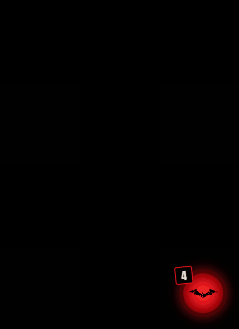
</p>

**Status:** v1.0 for Windows 10/11. [Download it](#install), or see the [roadmap](docs/ROADMAP.md).

Bat-Signal rests in a corner of your screen as a small signal disc. When something happens, the disc lights up and a notice card rises from it; click it to open the full panel right on that case. It:

- tells you when a Claude Code session finishes replying;
- shows which sessions are active and what each one is doing (tasks, subagents, background commands);
- tells you when tasks finish;
- gathers everything that **needs you** in one place (permission prompts, Claude waiting for input, errors);
- takes you **to the session's terminal** in one click, bringing its Windows Terminal window and tab to the front;
- shrinks to a **watch strip**, one line per session, to follow the work from the corner;
- has a mascot: **Bat-Clawd**, Claude Code's Clawd in a cowl and cape. He sleeps wrapped in his cape when all is quiet, takes off with it streaming behind him when a session is working, and throws it open when something needs you: black inside too, but for a thin red thread along its hem.

The look is inspired by the reds and blacks of *The Batman* (2022): every session is a case file, every alert a red ink stamp, with rain falling behind it all.

## A closer look

| Needs you | A case | A notice from the disc |
|---|---|---|
|  |  | 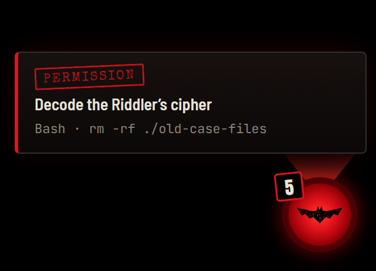 |

| Cases | Task drawer | All quiet |
|---|---|---|
|  |  |  |

| Watch strip | The night report theme | A case opened in the report |
|---|---|---|
| 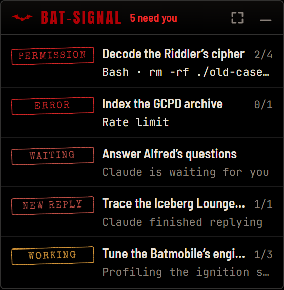 | 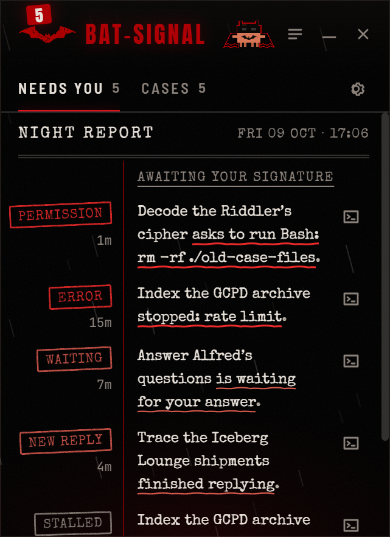 | 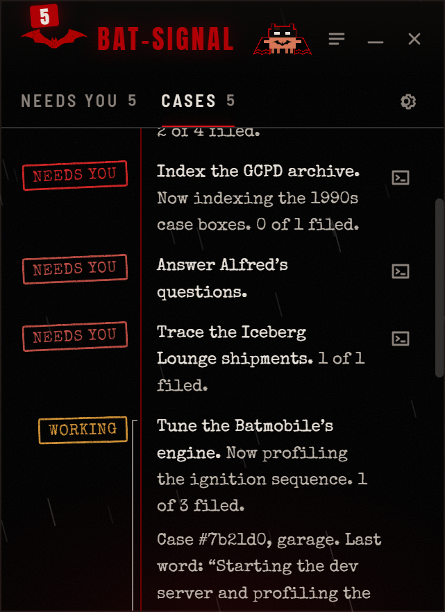 |

| Settings | Comfort, notifications and sound | The Bat-Signal at rest |
|---|---|---|
|  | 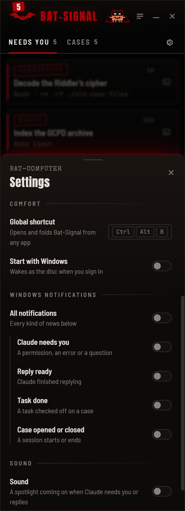 | 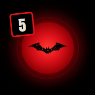 |

| The tray icon, at rest and lit |
|---|
| 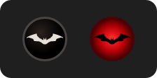 |

| Bat-Clawd asleep | On patrol | Needs you |
|---|---|---|
| 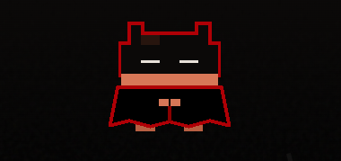 | 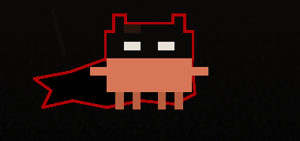 | 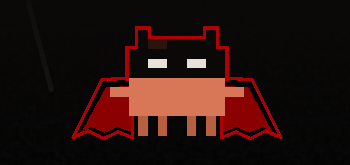 |

Screenshots use made-up data (`npm run shots`), never real sessions.

## Install

1. **Download** `Bat-Signal-Setup-<version>.exe` from the [Releases page](https://github.com/lucas-moont/bat-signal/releases) and run it. It installs for you alone, with no admin prompt, adds Bat-Signal to the Start menu and opens it.
2. **Install the plugin** in Claude Code, for instant alerts:

```bash
claude plugin marketplace add lucas-moont/bat-signal
claude plugin install bat-signal@bat-signal
```

Without the plugin, Bat-Signal still works from the files Claude Code writes: it lists sessions, their tasks and progress, and notices when a turn ends; with it, it also shows **permission prompts**, **Claude waiting for you** and **errors** the moment they happen. Needs you says so when the plugin is silent.

The plugin is observe-only and does nothing when the app is closed. Details in [docs/plugin.md](docs/plugin.md). Coming from Batcave? See [upgrading](docs/plugin.md#upgrading-from-batcave): the old plugin must be removed first.

### "Windows protected your PC"

The installer is not code-signed yet: a signing certificate costs money and identity paperwork, and this is a one-person open-source project (see [docs/research/code-signing.md](docs/research/code-signing.md)). Windows SmartScreen warns about any new, unsigned download; the warning says nothing about what the app does.

1. Download the installer only from this repository's [Releases page](https://github.com/lucas-moont/bat-signal/releases).
2. Optionally, check it against `SHA256SUMS.txt` from the same release: `Get-FileHash .\Bat-Signal-Setup-<version>.exe -Algorithm SHA256` prints its hash in capitals and `SHA256SUMS.txt` has it in lowercase: they must match, letter for letter.
3. If your browser says the file isn't commonly downloaded, choose to keep it.
4. When Windows shows "Windows protected your PC", click **More info**, check the app name, then **Run anyway**.

If **Smart App Control** is on (Windows 11, under Windows Security → App & browser control), Windows blocks unsigned apps and offers no "Run anyway", nor any exception for one app. We'd rather you wait for a signed release than turn off a security feature for us.

### Uninstall

From Windows Settings → Apps. Uninstalling also removes Bat-Signal from the apps that start with Windows, and keeps your settings in `%APPDATA%\Bat-Signal` for the next install.

## Using it

Bat-Signal starts as the signal disc in the bottom-right corner: drag it anywhere, click it to open the panel. The strip button shrinks the panel to the watch strip, and the disc reopens whichever you used last. Drag the panel by its header and resize it from any edge; Esc or the fold button folds it back into the signal. The night report theme is in Settings.

The bat by the clock is Bat-Signal's tray icon, lit red while something needs you. Click it to open or fold the panel; its menu switches between the disc, the panel and the watch strip, hides everything, opens Settings, and quits. Closing the disc or the panel's close button hides Bat-Signal to the tray instead of quitting, and launching it again brings it back.

**Ctrl+Alt+B**, from any app, does what a click on the disc does: it opens the panel or the watch strip (whichever you used last) and folds it back, and it brings a hidden Bat-Signal back. Change it under Settings → Comfort: click the keys and press new ones (Esc cancels, Backspace turns it off). If another app already holds the combination, Settings says so in red. On keyboards where Ctrl+Alt acts as AltGr (Portuguese ABNT2, German, French), a combination that types a character is refused, so typing keeps it.

**Start with Windows** (Settings → Comfort) has Bat-Signal wake as the disc when you sign in, without taking the focus. The switch shows what Windows will do: turn the entry off in Task Manager's Startup apps and the switch says so.

**Windows notifications** (Settings → Windows notifications, all off at first) add a Windows toast to the Bat-Signal for the kinds of news you pick: Claude needs you, a reply is ready, a task is done, a case opened or closed. A burst of news is one toast (the most urgent, with a count of the rest), the same news never comes twice, and none come while the panel is the window in front. Click one to open its case.

**Sound** (Settings → Sound, off at first) gives news a voice: a spotlight coming on when Claude needs you, replies or finishes a task. A burst of news is one sound, at most one every four seconds, at the volume you set (Test plays it). It keeps quiet while the panel is in front, while something runs full screen or a presentation is on, and still plays while Bat-Signal is hidden in the tray. Windows 11's Do Not Disturb is not reported to apps, so it does not hush the sound; the toasts do follow it. To ask Windows quickly, Bat-Signal keeps one PowerShell open while sound is on (the terminal button shares it). The sounds are CC0 recordings, credited in [`app/src/renderer/src/assets/sounds/`](app/src/renderer/src/assets/sounds/LICENSE.md).

## Light on resources

A window parked in a corner all day has to be cheap. Every looping effect runs off one clock ticking eight times a second instead of 60 fps CSS animations, Bat-Clawd is a flip-book of finished poses, and the rain only falls while you are looking. Measured on the real windows (all Bat-Signal processes, GPU included, 30-second samples):

| | At rest | Something needs you |
|---|---|---|
| The disc | 0.1–0.2% of one core | 0.1–0.8% |
| The watch strip, Bat-Clawd on the perch | 0.4–0.8% | 0.2–0.5% |
| The panel open | | 0.7–2.0% |

The disc only pulses for the few seconds an urgent notice is out, and Bat-Clawd keeps watch from the perch mostly still.

## How it works

Bat-Signal reads what Claude Code already writes under `~/.claude/` (never the `*.key` files beside your sessions, which hold secrets) and, with the plugin, what Claude Code's hooks report. It only watches: nothing leaves your PC (it listens only on `127.0.0.1` and opens no outgoing connection), and the plugin can't approve or change anything.

- [Architecture](docs/architecture.md): how files and hooks become one snapshot, and where it goes
- [What it reads and writes](docs/data-format.md)
- [The plugin](docs/plugin.md): what it sends, and why it is safe
- [Design](docs/design.md): the design system and the promise every change keeps
- [Changelog](CHANGELOG.md)

## Contributing

Running it from source, the checks, building the installer and releasing are in [CONTRIBUTING.md](CONTRIBUTING.md).

---

Fan project. Not affiliated with Warner Bros., DC Comics or Anthropic.

License: [MIT](LICENSE).
