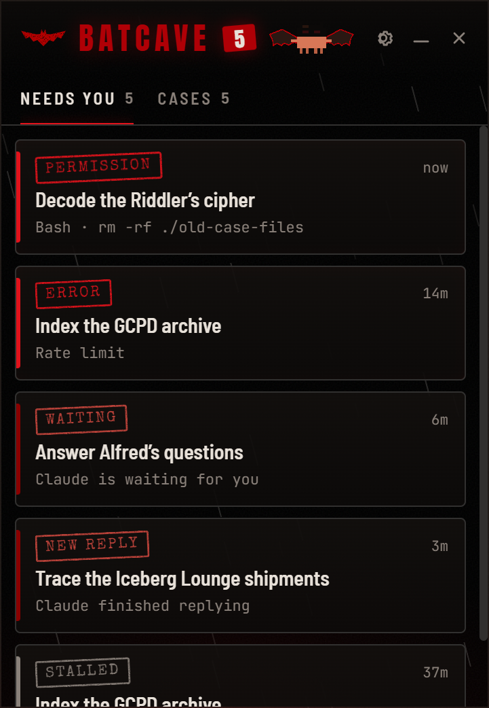
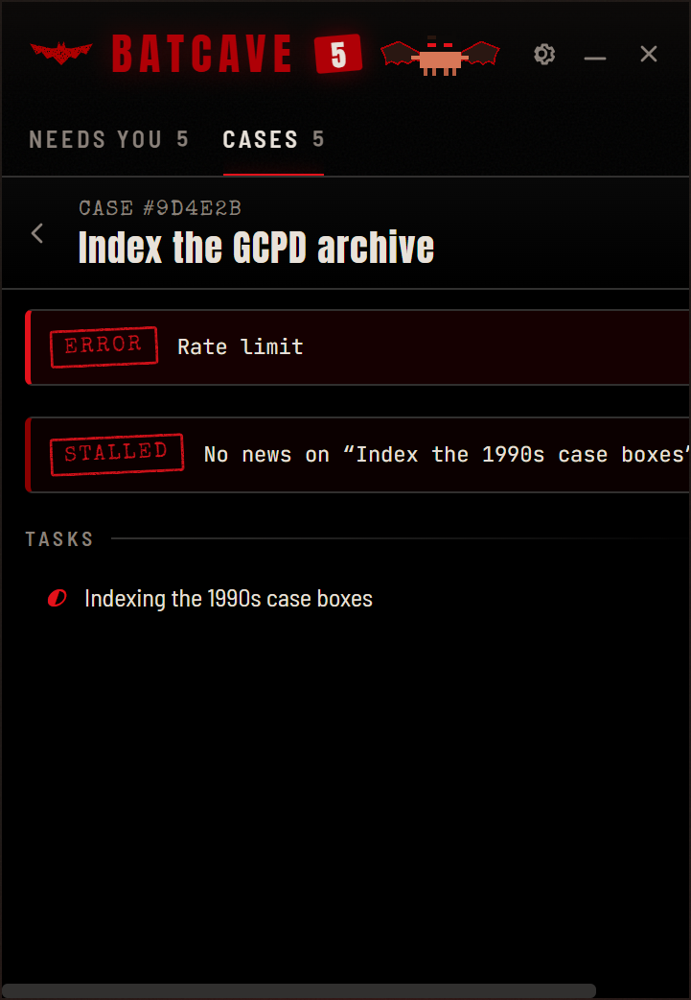
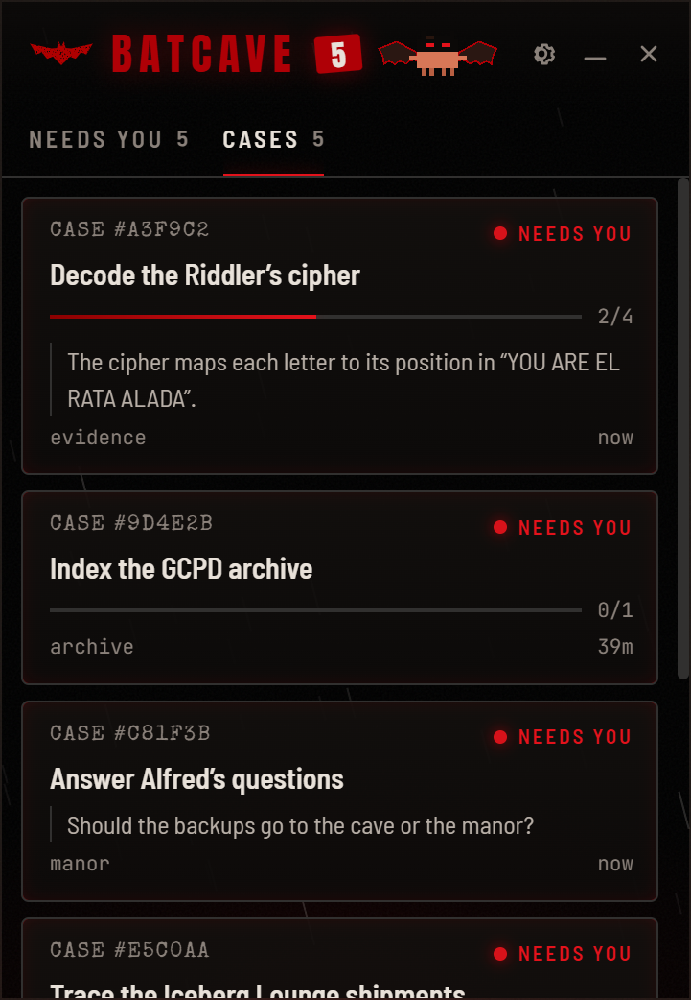
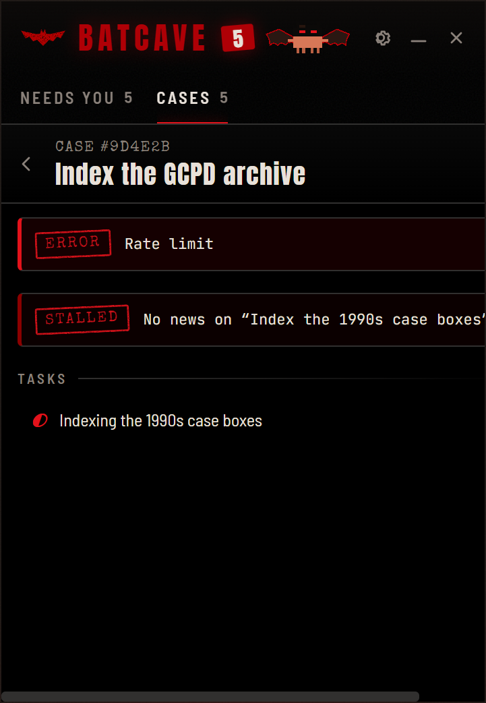
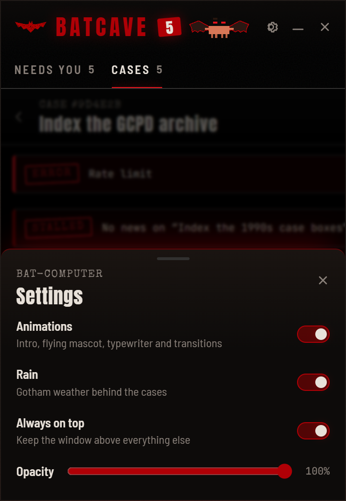
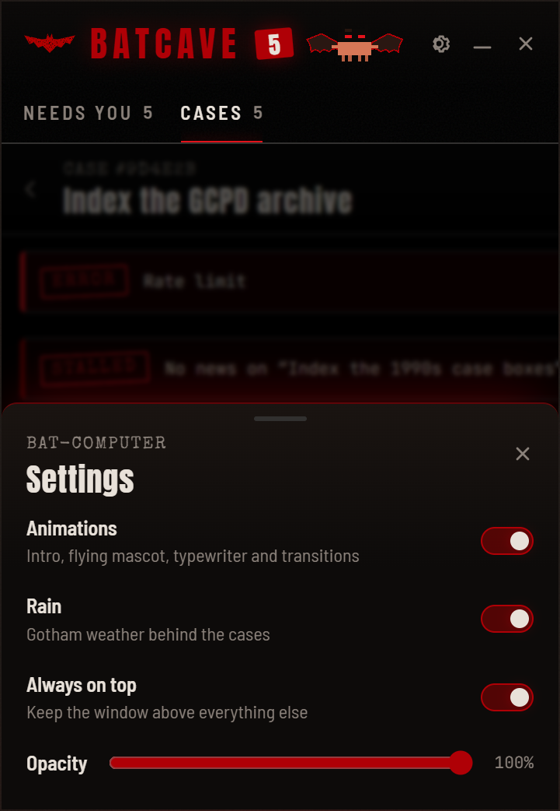
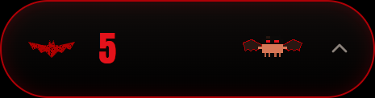

# Batcave

> A tiny window in the corner of your screen that watches your **Claude Code** sessions like the Bat-Computer.

<p align="center">
  
  &nbsp;&nbsp;
  
</p>

**Status:** under construction (v0). See the [roadmap](docs/ROADMAP.md).

Batcave is a small desktop app that stays on top of your other windows and:

- tells you when a Claude Code session finishes replying;
- shows which sessions are active and what each one is doing (tasks, subagents, background commands);
- tells you when tasks finish;
- gathers everything that **needs you** in one place (permission prompts, Claude waiting for input, errors);
- has a mascot: **Bat-Clawd**, Claude Code's Clawd in a cowl. It sleeps upside down when all is quiet, takes off when a session is working and turns red-eyed when something needs you.

The look is inspired by the reds and blacks of *The Batman* (2022): every session is a case file, every alert a red ink stamp, with rain falling behind it all.

## A closer look

| Cases | Task drawer | All quiet |
|---|---|---|
|  |  |  |

| Settings | Pill mode |
|---|---|
|  |  |

Screenshots use made-up data (`npm run shots`), never real sessions.

## Getting started

Requirements: Windows 10/11, Node.js 24+ and Claude Code.

```bash
cd app
npm install
npm run dev
```

Batcave already works from the files Claude Code writes. For instant alerts, including permission prompts, install the plugin:

```bash
claude plugin marketplace add lucas-moont/batcave
claude plugin install batcave@batcave
```

The plugin is observe-only and does nothing when the app is closed. Details in [docs/plugin.md](docs/plugin.md).

Drag the window by its header, resize it from any edge, or shrink it to a pill. It reopens where you left it.

## Light on resources

A window parked in a corner all day has to be cheap. Every looping effect runs off one clock ticking eight times a second instead of 60 fps CSS animations, Bat-Clawd is a flip-book of finished poses, and the rain only falls while you are looking. Measured idle cost: about **1% of one CPU core** when all is quiet, about **4%** while alerts pulse.

---

Fan project. Not affiliated with Warner Bros., DC Comics or Anthropic.

License: [MIT](LICENSE).
